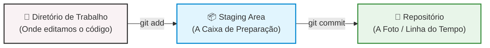
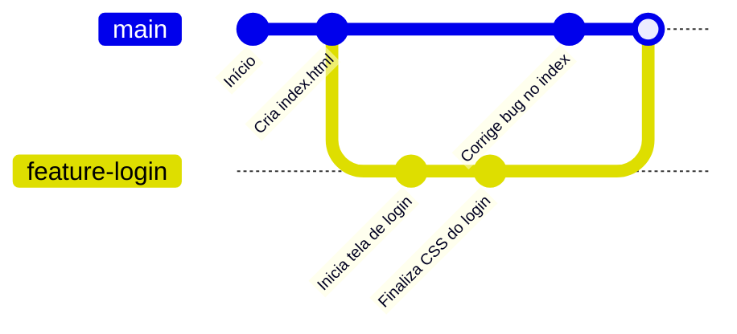

---

# 🚀 Dominando Git e GitHub: A Máquina do Tempo do Código

## O Fim do "Trabalho_Final_V3_AgoraVai.docx"

Quem aqui já fez um trabalho escolar e a pasta acabou ficando cheia de arquivos com nomes bizarros para não perder as versões antigas?

No desenvolvimento profissional de aplicativos, fazer isso com milhares de linhas de código e uma equipe inteira trabalhando junto é a receita para o desastre.

Para resolver isso, usamos o **Versionamento de Código**. Ele funciona como uma verdadeira "máquina do tempo": tira "fotos" (snapshots) exatas do nosso projeto. Se algo der errado hoje, podemos voltar o código exatamente para como estava na terça-feira passada em segundos.

---

## 🛠️ Git vs GitHub: Qual é a diferença?

Muitos desenvolvedores iniciantes confundem os dois, mas eles são coisas diferentes:

- **Git (O Motor):** É o programa que roda localmente no nosso computador (mesmo sem internet). Ele é o responsável por gerenciar a máquina do tempo.
    
- **GitHub (A Nuvem):** É o site (a "rede social" dos programadores). É lá que guardamos uma cópia segura do nosso repositório para podermos trabalhar em equipe e acessar o código de qualquer computador do mundo.
    

---

## ⚙️ Configuração Inicial: Apresentando-se para o Git

Antes de começarmos a viajar no tempo, o Git precisa saber quem está no controle da máquina. Abram o terminal (ou o terminal integrado do VS Code) e digitem os comandos abaixo com os dados de vocês:

Bash

```
# Configurando o seu nome (Use aspas!)
git config --global user.name "Seu Nome Completo"

# Configurando o seu email
git config --global user.email "seu_email@escola.com"

# Conferindo se deu certo:
git config --list
```

---

## 📦 O Ciclo de Vida do Código (Local)

O Git divide o nosso projeto em 3 "áreas" principais. Precisamos entender esse caminho para não perder nenhum arquivo.

Snippet de código



### 1. Inicializando o Projeto

Crie uma pasta chamada `meu_primeiro_app`, abra-a no VS Code e digite no terminal:

Bash

```
git init
```

> **Nota:** Isso cria uma pasta oculta chamada `.git`. É aqui que a mágica acontece. Nunca apague essa pasta!

### 2. O Fluxo de Trabalho (Mão na Massa!)

**Passo A:** Criem um arquivo chamado `index.html` e escrevam qualquer coisa dentro dele.

**Passo B:** Vamos perguntar ao Git o que está acontecendo:

Bash

```
git status
```

_(O arquivo deve aparecer em vermelho. O Git viu que ele existe, mas não está cuidando dele)._

**Passo C:** Vamos colocar o arquivo na caixa de preparação (Staging):

Bash

```
git add .
```

_(O ponto `.` significa "adicione TUDO que foi alterado". Digite `git status` novamente e veja que agora está verde)._

**Passo D:** Vamos fechar a caixa e bater a foto (Commit):

Bash

```
git commit -m "Cria a estrutura inicial do aplicativo"
```

_(A tag `-m` significa "mensagem". Seja sempre claro e direto no que você fez)._

**Passo E:** Vamos ver o nosso histórico de viagens no tempo:

Bash

```
git log
```

---

## ☁️ Indo para a Nuvem (GitHub)

Nosso código está seguro no computador, mas e se o HD queimar? Vamos mandar para a nuvem!

1. Acessem **github.com** e façam login.
    
2. Cliquem no botão **New** (Novo Repositório).
    
3. Nomeiem como `meu_primeiro_app`. (Deixem Público e não adicionem o README agora).
    
4. O GitHub vai mostrar uma tela com comandos. Vamos focar nestes dois:
    

**Conectando o computador à nuvem:**

_(Copie o comando gerado no SEU GitHub, será parecido com este)_

Bash

```
git remote add origin https://github.com/SEU_USUARIO/meu_primeiro_app.git
```

> **Dica:** `origin` é apenas o apelido carinhoso que damos para o endereço do nosso projeto no servidor da Microsoft.

**O Grande Empurrão (Push):**

Vamos enviar o código do nosso PC para a internet:

Bash

```
git push -u origin main
```

_(Agora, vão até a página do GitHub e atualizem a tela apertando F5. O código de vocês está lá!)_

---

## 🔀 Branches: O Multiverso da Programação

Imagine que o nosso app está no ar, funcionando perfeitamente. O cliente pediu para testarmos uma nova tela de "Login". Se fizermos isso direto no código principal e algo der errado, o sistema inteiro quebra.

A solução? Criar um universo paralelo: uma **Branch** (Ramificação).

Snippet de código



### 1. Criando e viajando para o universo paralelo

Bash

```
# Cria a ramificação
git branch feature-login

# Entra na ramificação
git checkout feature-login
# (Nas versões mais novas do Git, você também pode usar: git switch feature-login)
```

### 2. Trabalhando com segurança

Agora, criem um arquivo chamado `login.html`.

Adicionem e salvem na máquina do tempo:

Bash

```
git add .
git commit -m "Adiciona a nova tela de login"
```

### 3. O Casamento (Merge)

A tela de login ficou incrível e foi aprovada. Vamos voltar para a dimensão principal e puxar as novidades para cá!

**Voltando para a dimensão original (main):**

Bash

```
git checkout main
```

_(Reparem no VS Code: o arquivo login.html sumiu magicamente! Não se desesperem, ele está seguro na outra dimensão)._

**Puxando o código (Merge):**

Bash

```
git merge feature-login
```

_(O arquivo login.html reapareceu na linha do tempo principal!)_

Para finalizar, é só dar o comando de empurrar as novidades para o chefe ver na nuvem:

Bash

```
git push
```

---

**🚨 COMANDO DE SOCORRO:**

Se em algum momento o terminal abrir uma tela esquisita (o editor VIM) e não deixar vocês digitarem mais nada, não entrem em pânico. Para sair, basta digitar exatamente isso:

Pressione `ESC`, depois digite `:wq` e pressione `ENTER`.